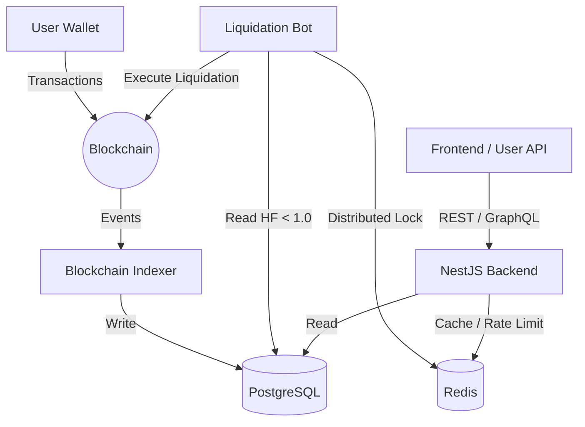

# Aave-Inspired DeFi Lending Protocol Architecture 🏗️

Welcome to the internal architecture and terminology documentation for the lending protocol. This document is designed to give developers a deep mental model of how the protocol operates, the core math involved, and how the out-of-band services (indexer, backend, bots) interact with the blockchain.

---

## 📖 Core Terminologies

Before diving into the architecture, it is essential to understand the following recurring terms:

### Smart Contract Terms

- **Reserve / Market**: A specific asset (e.g., USDC, WETH) configured for supplying and borrowing within the protocol.
- **aToken**: An interest-bearing receipt token minted when a user deposits an asset. Its balance grows automatically as interest accrues. (e.g., aUSDC for USDC deposits).
- **DebtToken**: A non-transferable token representing a user's outstanding loan. Its balance grows as borrow interest accrues.
- **Health Factor (HF)**: A numeric representation of a position's safety.
  - `HF > 1.0`: The position is safe and sufficiently collateralized.
  - `HF < 1.0`: The position is undercollateralized and eligible for liquidation.
- **Liquidation Threshold**: The percentage at which a position is defined as undercollateralized. (If the threshold is 80%, debt can only be up to 80% of collateral value before liquidation occurs).
- **LTV (Loan-to-Value)**: The maximum borrowing power of a specific collateral asset. (e.g., 75% LTV means $100 of ETH deposits allows borrowing $75 of USDC).
- **Liquidation Bonus**: The discount given to liquidators when they buy a liquidated user's collateral. (e.g., a 105% bonus means the liquidator buys the collateral at a 5% discount).

### Math Terms

- **Wad**: Fixed-point math representing 18 decimals (1e18). Standard for most ERC20 token math and health factor calculations.
- **Ray**: Fixed-point math representing 27 decimals (1e27). Used for precise interest rate accumulation where `Wad` would lose precision over short time intervals.

---

## ⚙️ How It Works (The Lifecycle)

### 1. Supply (Deposit)

1. A user calls `deposit(asset, amount, onBehalfOf)` on the `LendingPool.sol`.
2. The `LendingPool` updates the state (accruing interest up to the current block timestamp).
3. The underlying `asset` is transferred from the user to the `aToken` contract.
4. The `aToken` mints `amount` of aTokens to the `onBehalfOf` address.
5. The Indexer detects the `Deposit` event, updates the PostgreSQL `deposits` and `user_positions` tables.

### 2. Borrow

1. A user calls `borrow(asset, amount, onBehalfOf)` on the `LendingPool.sol`.
2. The `LendingPool` verifies that the user has enough collateral deposited across all their active markets to borrow the requested `amount`.
3. The `LendingPool` updates the internal interest state.
4. The `DebtToken` mints `amount` of debt tokens to the `onBehalfOf` address.
5. The underlying `asset` is transferred from the `aToken` contract to the user.
6. The Indexer detects the `Borrow` event, recording the debt in the PostgreSQL database.

### 3. Interest Accrual

In this protocol, interest is not accrued via a centralized "crank" or nightly bot. It accrues **lazily**:

- Whenever ANY interaction (deposit, borrow, withdraw, repay, liquidate) occurs on a specific `Reserve`, the `updateState()` function is called first.
- `updateState()` calculates the time elapsed since the last time the reserve was touched.
- Using a Taylor series approximation for compound interest, it inflates the `liquidityIndex` (deposit growth multiplier) and `variableBorrowIndex` (debt growth multiplier).

### 4. Liquidation

When a user's collateral value falls, or their debt value rises, their **Health Factor** may drop below `1.0`.

1. The **Liquidation Bot** (running off-chain) is constantly scanning the backend database's `user_positions` table for `HF < 1.0`.
2. The bot acquires a distributed Redis lock for the target user to prevent other bot instances from racing.
3. The bot simulates a liquidation call against the blockchain. If profitable, it executes `liquidationCall()` on the `LendingPool.sol`.
4. The `LendingPool` burns the liquidator's provided debt asset, repays the target user's debt, and transfers the target user's collateral (plus the liquidation bonus) to the liquidator.

---

## 🏛️ System Architecture

### 1. Smart Contracts (The Source of Truth)

Written in Solidity using the Foundry framework.

- **UUPS Proxy Pattern**: Upgrades are handled via `delegatecall`. The logic contract inherits `UUPSUpgradeable`, meaning the upgrade logic resides in the implementation, not the proxy.
- **Storage**: Uses `LendingPoolStorage.sol` as an inherited base to strictly control storage slots and prevent collisions during protocol upgrades.
- **Math**: Extracts all fixed-point math to pure libraries (`WadRayMath.sol`, `PercentageMath.sol`) to optimize gas and ensure safety.

### 2. The Blockchain Indexer (The Nervous System)

A standalone Node.js service that maintains a 1-to-1 replica of the blockchain's state within a traditional relational database.

- **Event-Driven**: Subscribes to new blocks via WebSockets.
- **Idempotent**: Uses PostgreSQL `ON CONFLICT DO NOTHING` statements using `(tx_hash, log_index)`. If the indexer crashes, it safely resumes without duplicating records.
- **Reorg Safe**: Tracks `parentHash` on every block. If a chain reorganization occurs (e.g., the chain forks and a different longest chain takes over), the indexer rolls back the database state to the common ancestor block and re-indexes the new chain.

### 3. NestJS Backend (The Read Layer)

The blockchain itself is slow and difficult to query for complex aggregations. The NestJS API solves this.

- **Clean Architecture**: Strictly separates Controllers (HTTP logic), Services (Business logic), and Repositories (Database logic).
- **Fast Lookups**: APIs hit the PostgreSQL replica powered by the indexer, allowing instant responses for complex dashboard queries like "What is the historical APY for the last 30 days?".
- **Caching**: Extensive use of Redis for Hot-paths (like fetching standard asset prices or global platform TVL).

### 4. Liquidation Bot (The Immune System)

A decentralized protocol relies on economic incentives to stay solvent.

- **Health Scanner**: A polling loop fetching users from the backend API.
- **Fail-Safe Processing**: Deployed in a distributed manner. Uses Redis `SETNX` (Set if Not eXists) with TTLs to form a distributed mutex lock. This ensures that if you run 5 bot servers to guarantee uptime, they won't all try to liquidate the exact same user at the exact same millisecond (saving massive gas fees on failed transactions).

---

## 📊 Database Schema Design

The PostgreSQL database is heavily normalized to support complex analytical queries while handling high write throughput from the indexer.

- `users`: Tracks interacting wallet addresses.
- `markets`: Global protocol configurations for reserves (USDC, WETH, etc).
- `deposits` & `borrows`: Append-only ledgers of all historical user actions.
- `user_positions`: A materialized representation of current aggregated state per user-market pair (highly indexed for rapid health factor scans via the bot).
- `raw_events`: Raw blockchain logs with TX hashes (used for reorg rollbacks).
- `block_sync_state`: A single cursor row tracking exactly which block the indexer is currently parsing.

---

## 🔒 Security Posture

- **No Floating Point Operations**: Solidity cannot handle floats natively. Bypassing this with Wad/Ray fixed-point precision ensures no internal rounding errors snowball over time.
- **Circuit Breakers**: `PausableUpgradeable` gives emergency multisigs the ability to freeze protocol deposits/borrows in the event of a zero-day vulnerability discovery.
- **API Guarding**: Global NestJS exception filters prevent leaking JS stack traces to clients. JWT verification and Redis rate-limiting protect against DDoS attempts targeting database-heavy queries.
